[Course link](https://www.udemy.com/course/react-redux/)

# React X ReactDOM

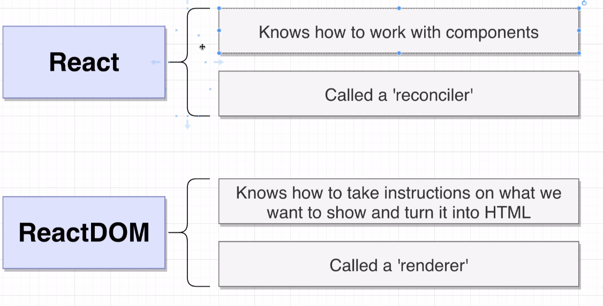

# useState Function
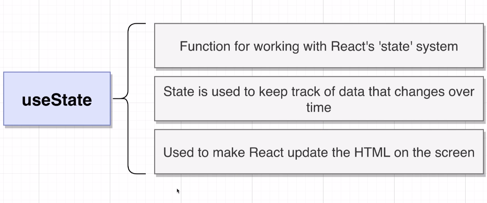

# How to create a react app
* The recommended method for generating a project is now:
npx create-react-app my-app
* If you get any errors about missing templates or how a global Create React App install is no longer supported even when using this command, you likely need to remove the global package from your system:
* npm uninstall -g create-react-app
* Note - extra step is needed for Mac / Linux users to manually delete the folder:
* rm -rf /usr/local/bin/create-react-app

# Why create-react-app?
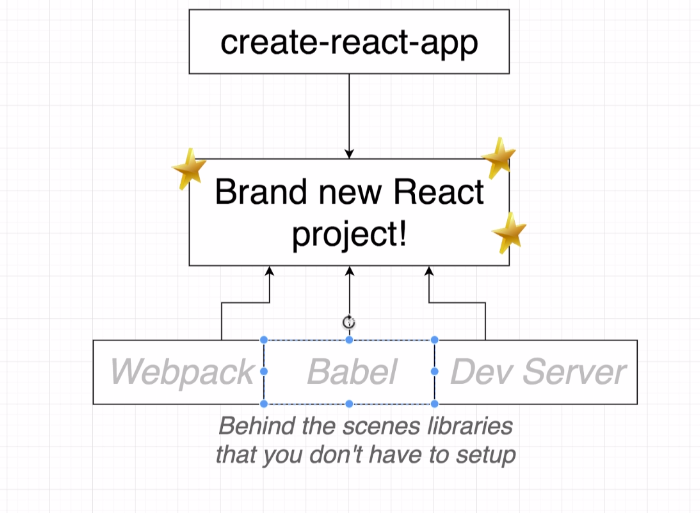

## Babel work:
* ES2015 JS -> BABEL -> ES5 JS.
* It takes the new versions os javascript and 'transform' in a version that browsers can interpreter.

# Exploring a create-react-app project.


# Difference between ES2015 Modules -> import and CommonJS Modules -> require
* ES2015 Import statement -> import
* CommonJS require statement -> require

# Important Note about Live Reloading
* There appears to be an issue in CRA in regards to fast refresh when code changes are made to the index.js file:
* https://github.com/facebook/create-react-app/issues/9904
* Manually refreshing will show the changes, also, any changes to components deeper in the file structure will cause an auto-refresh as expected.
* One workaround noted suggests putting the following in the index.js which enables reloading:

```javascript
if (module.hot) {
  module.hot.accept();
}
```
* Note - If you have spaces in your project directory name, reloading throughout the whole application can also fail.


# What is a React Component?
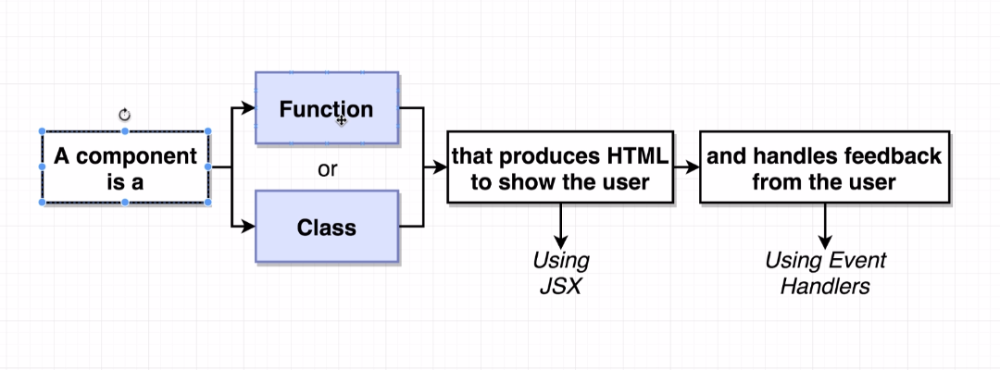

# What is JSX?
* It's similar html, but its the 'translation' of react content made by babel.
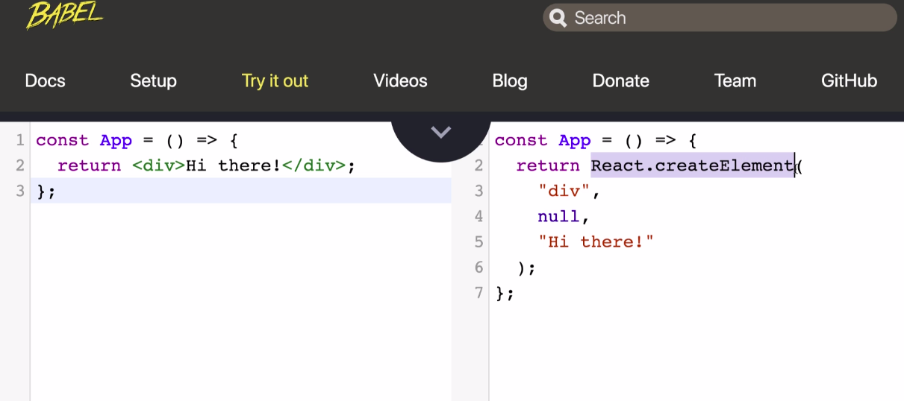
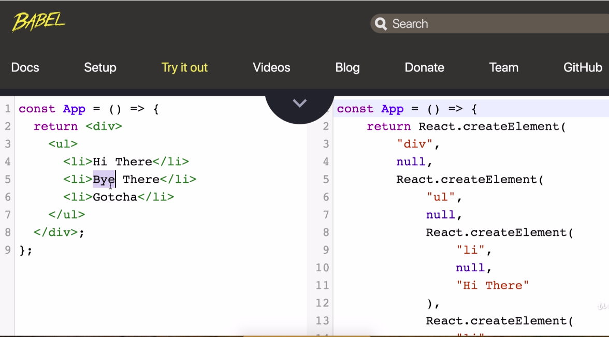
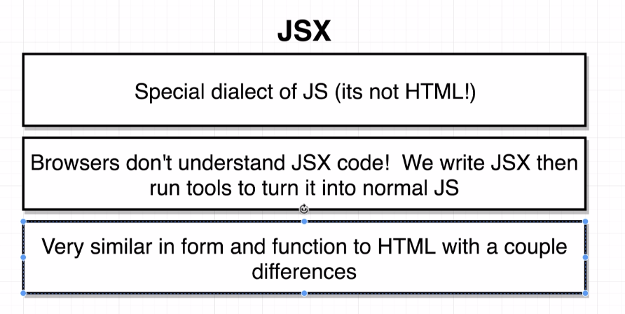

# JSX vs HTML
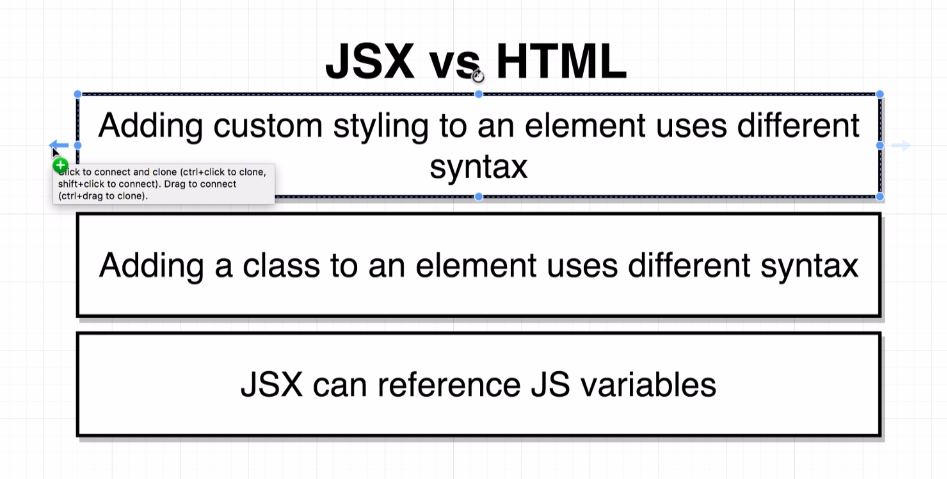
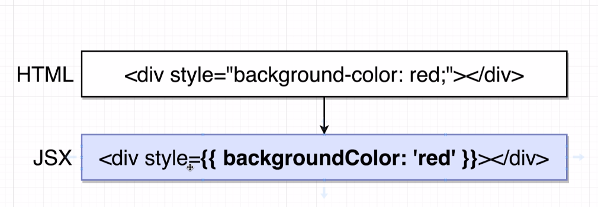
* First braces indicate de javascript variable and second meant a javascript object.

# Three Tenets of Components
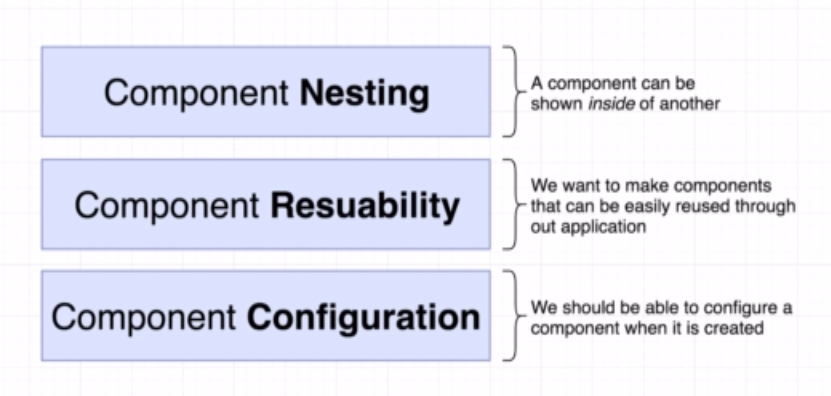

# Open Source Styling CSS framework
* https://semantic-ui.com
* https://cdnjs.cloudflare.com/ajax/libs/semantic-ui/2.4.1/semantic.min.css
* https://cdnjs.com/libraries/semantic-ui

# Library that helps developing with mocks
* faker.js
* https://github.com/marak/Faker.js/
* npm install --save faker

# Creating a Reusable Configurable Component


# Props
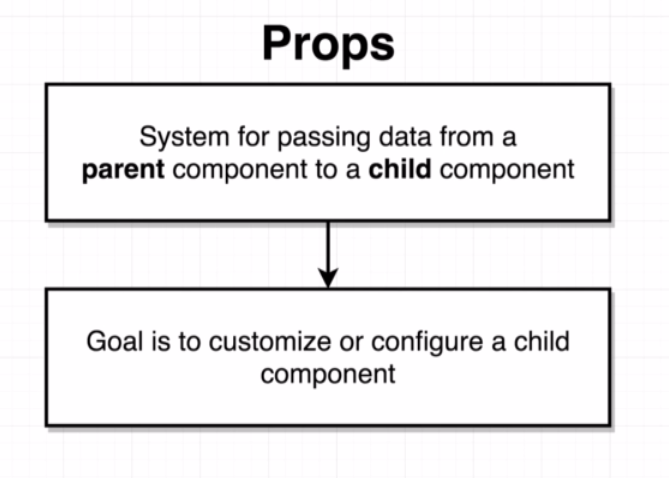
* Example show different names in comments.

# Class Components
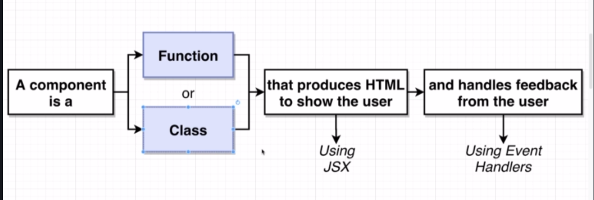
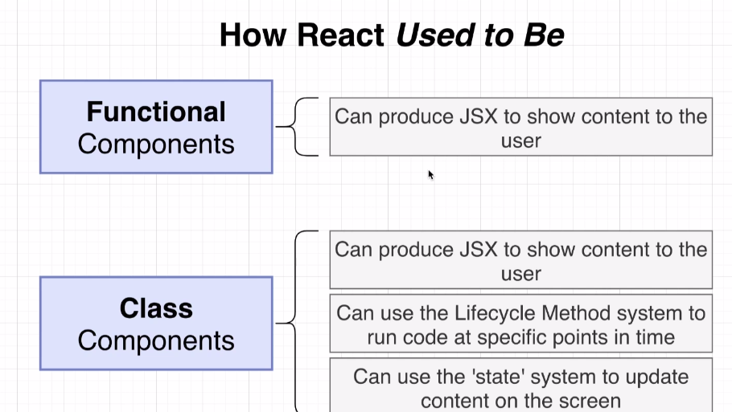
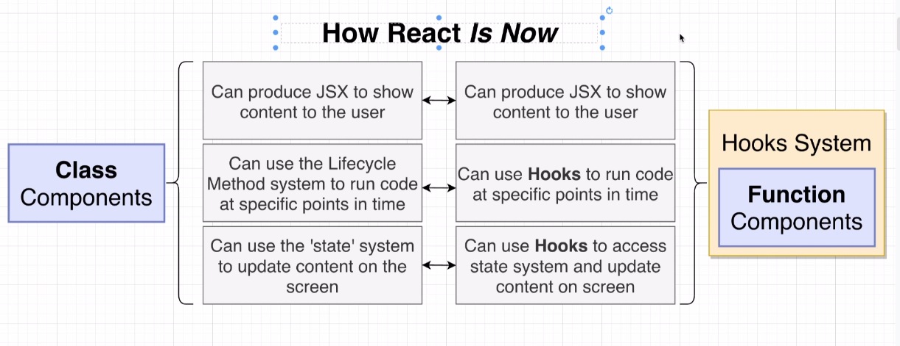
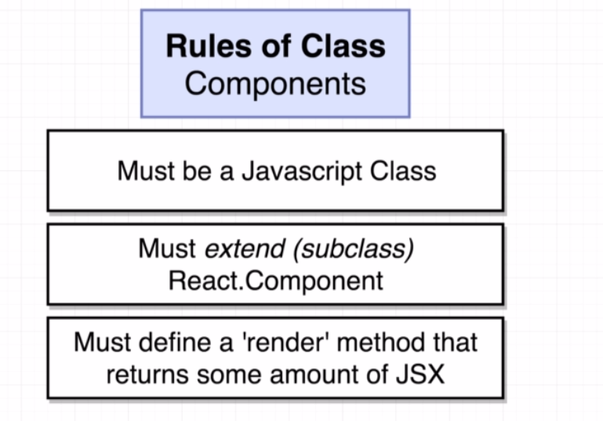
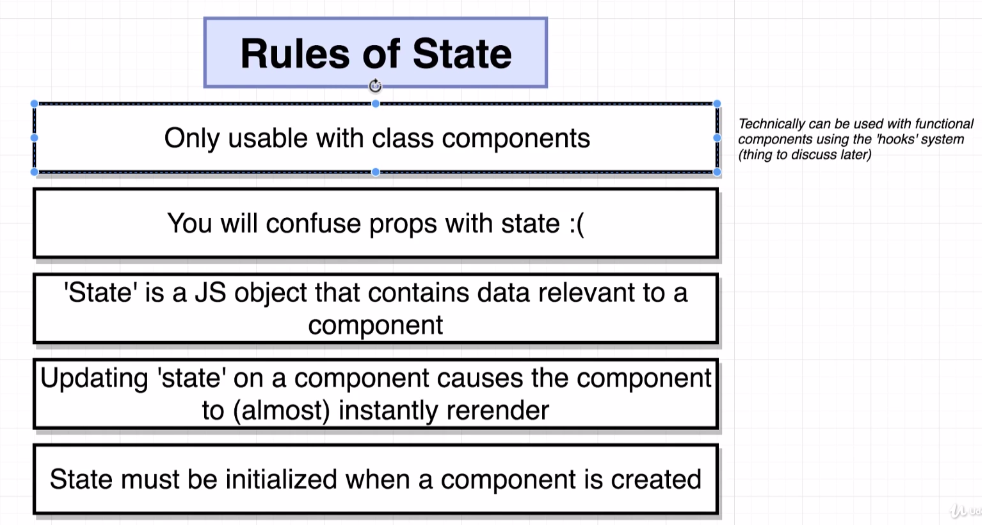
* STATE CAN **ONLY** BE UPDATED USING THE FUNCTION 'setState'

# Component Lifecycle

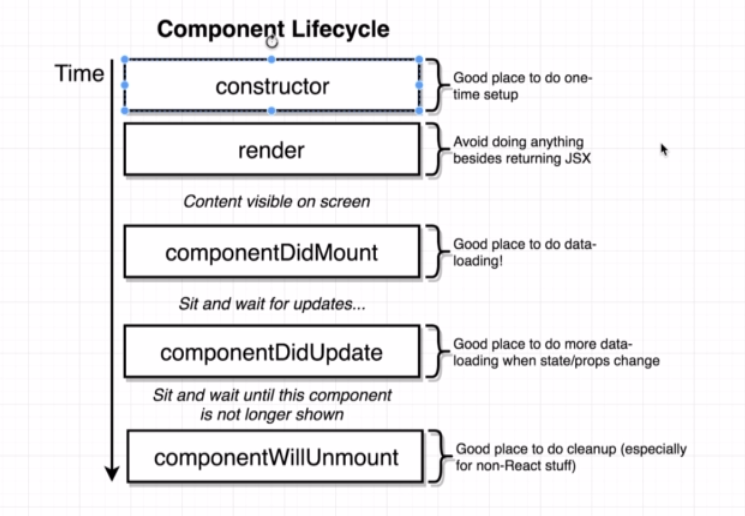


# Solving Context Issues

```javascript

class Car {
  constructor() {
    //OLD FASHION
    this.drive = this.drive.bind(this);
  }

  setDriveSound(sound) {
    this.sound = sound;
  }

  drive() {
    return this.sound;
  }

}

const Car = new Car();
car.setDriveSound('vroom');

const drive = car.drive;

drive(); //IF WITHOUT CONSTRUCTOR THE RETURN WILL BE 'cannot read undefined'

```

```javascript
class Car {
  setDriveSound(sound) {
    this.sound = sound;
  }


  //OTHER WAY
  drive = () => {
    return this.sound;
  }

}

const Car = new Car();
car.setDriveSound('vroom');

const drive = car.drive;

drive(); //IF WITHOUT CONSTRUCTOR THE RETURN WILL BE 'cannot read undefined'

```

# React Refs

* Gives access to a single DOM element
* We create refs in constructor, assign them to instance variables, then pass to a particular JSX element as props.

# React Hooks

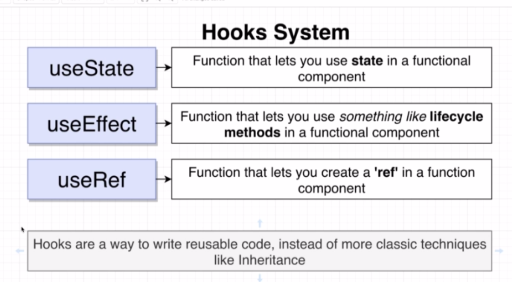
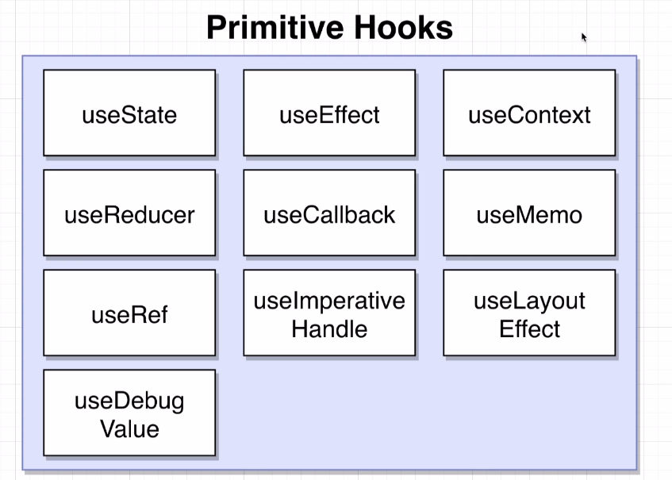

# Understanding useState

```javascript
//ARRAY DESTRUCTURING

const colors = ['red', 'green'];

colors[0]; // 'red'

colors[1]; // 'green'

const redColor = colors[0];
const greenColor = colors[1];

const [firstElement, secondElement] = colors;

const [x, setX] = useState(null); // CREATE ARRAY WITH 2 ELEMENTS, ONE PROPERTY ANOTHER FUNCTION

//IT IS THE SAME
const things = useState(null);
const activeThings = things[0];
const setActiveThings = things[1];

```

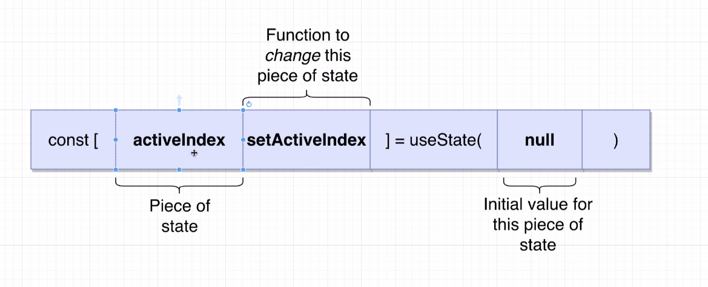
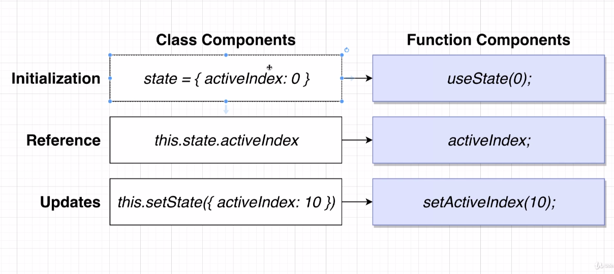
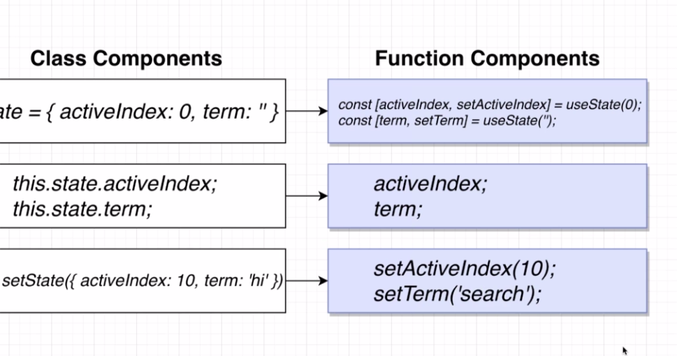

# The 'useEffect' Hook

* Allows function components to use something like lifecycle methods
* We configure the hook to run some code automatically in one of three scenarios.
* 1 - When the component is rendered for the first time only
* 2 - Whne the component is rendered **for the first time and whenever it rerenders**.
* 3 - When the component is reendered **for the first time and whenever it rerenders and some piece of data has changed**.

```javascript
useEffect(() => {
    console.log('I RUN EVERY RENDER AND AT INITIAL RENDER ');
  });

  useEffect(() => {
    console.log('I RUN EVERY INITIAL RENDER ');
  }, []);


  useEffect(() => {
    console.log('I RUN EVERY RENDER AND WHEN TERM CHANGES');
  }, [term]);

```


# ASYNC FUNCTION AT useEffect

```javascript
// CANNOT USE ASYNC IN THIS FUNCTION
useEffect(() => {
  

  //SOLUTION 1
  //THIS IS ALLOWED    
  const search = async () => {
    await axios.get('asdada');
  };
  search();


  //SOLUTION 2
  //DEFINES A FUNCTION AND EXECUTE IT
  (async () => {
    await axios.get('asdada');
  })();


  //SOLUTION 3
  //USING PROMISE
  axios.get('sadada')
    .then((response) => {
      console.log(response.data)
    });

}, [term]);


```


# XSS ATTACKS IN REACT

```jsx

<span dangerouslySetInnerHTML={{ __html: result.snippet }}></span>

```

* Execute javascript in our application