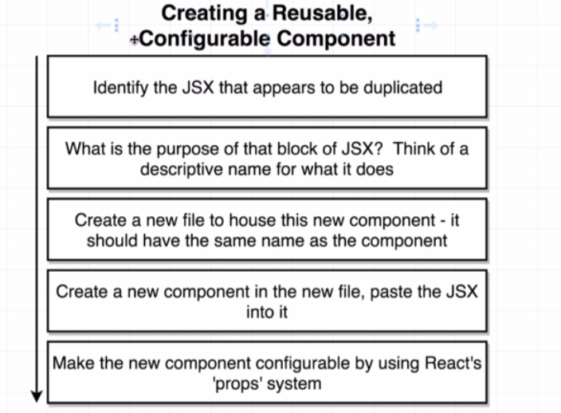

[Course link](https://www.udemy.com/course/react-redux/)

# React X ReactDOM


# useState Function


# How to create a react app
* The recommended method for generating a project is now:
npx create-react-app my-app
* If you get any errors about missing templates or how a global Create React App install is no longer supported even when using this command, you likely need to remove the global package from your system:
* npm uninstall -g create-react-app
* Note - extra step is needed for Mac / Linux users to manually delete the folder:
* rm -rf /usr/local/bin/create-react-app

# Why create-react-app?


## Babel work:
* ES2015 JS -> BABEL -> ES5 JS.
* It takes the new versions os javascript and 'transform' in a version that browsers can interpreter.

# Exploring a create-react-app project.


# Difference between ES2015 Modules -> import and CommonJS Modules -> require
* ES2015 Import statement -> import
* CommonJS require statement -> require

# Important Note about Live Reloading
* There appears to be an issue in CRA in regards to fast refresh when code changes are made to the index.js file:
* https://github.com/facebook/create-react-app/issues/9904
* Manually refreshing will show the changes, also, any changes to components deeper in the file structure will cause an auto-refresh as expected.
* One workaround noted suggests putting the following in the index.js which enables reloading:

```javascript
if (module.hot) {
  module.hot.accept();
}
```
* Note - If you have spaces in your project directory name, reloading throughout the whole application can also fail.


# What is a React Component?


# What is JSX?
* It's similar html, but its the 'translation' of react content made by babel.


# JSX vs HTML


* First braces indicate de javascript variable and second meant a javascript object.

# Three Tenets of Components


# Open Source Styling CSS framework
* https://semantic-ui.com
* https://cdnjs.cloudflare.com/ajax/libs/semantic-ui/2.4.1/semantic.min.css
* https://cdnjs.com/libraries/semantic-ui

# Library that helps developing with mocks
* faker.js
* https://github.com/marak/Faker.js/
* npm install --save faker

# Creating a Reusable Configurable Component


# Props

* Example show different names in comments.

# Class Components


* STATE CAN **ONLY** BE UPDATED USING THE FUNCTION 'setState'
