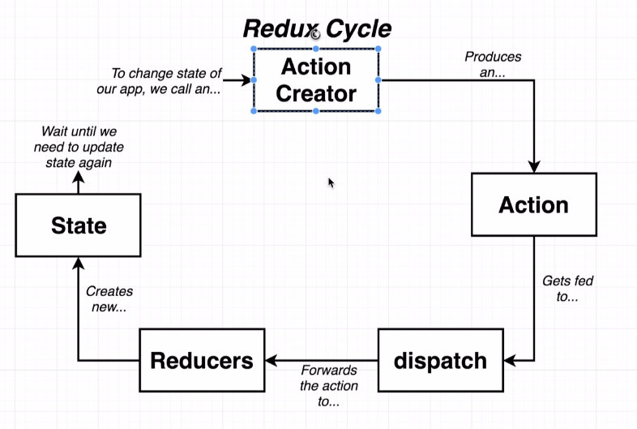
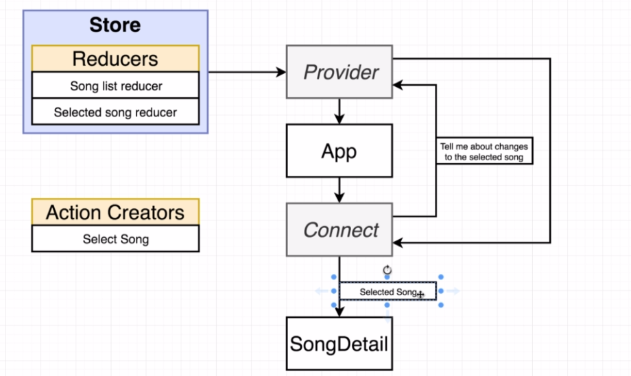

[Course link](https://www.udemy.com/course/react-redux/)

# React X ReactDOM


# useState Function


# How to create a react app
* The recommended method for generating a project is now:
npx create-react-app my-app
* If you get any errors about missing templates or how a global Create React App install is no longer supported even when using this command, you likely need to remove the global package from your system:
* npm uninstall -g create-react-app
* Note - extra step is needed for Mac / Linux users to manually delete the folder:
* rm -rf /usr/local/bin/create-react-app

# Why create-react-app?


## Babel work:
* ES2015 JS -> BABEL -> ES5 JS.
* It takes the new versions os javascript and 'transform' in a version that browsers can interpreter.

# Exploring a create-react-app project.


# Difference between ES2015 Modules -> import and CommonJS Modules -> require
* ES2015 Import statement -> import
* CommonJS require statement -> require

# Important Note about Live Reloading
* There appears to be an issue in CRA in regards to fast refresh when code changes are made to the index.js file:
* https://github.com/facebook/create-react-app/issues/9904
* Manually refreshing will show the changes, also, any changes to components deeper in the file structure will cause an auto-refresh as expected.
* One workaround noted suggests putting the following in the index.js which enables reloading:

```javascript
if (module.hot) {
  module.hot.accept();
}
```
* Note - If you have spaces in your project directory name, reloading throughout the whole application can also fail.


# What is a React Component?


# What is JSX?
* It's similar html, but its the 'translation' of react content made by babel.


# JSX vs HTML


* First braces indicate de javascript variable and second meant a javascript object.

# Three Tenets of Components


# Open Source Styling CSS framework
* https://semantic-ui.com
* https://cdnjs.cloudflare.com/ajax/libs/semantic-ui/2.4.1/semantic.min.css
* https://cdnjs.com/libraries/semantic-ui

# Library that helps developing with mocks
* faker.js
* https://github.com/marak/Faker.js/
* npm install --save faker

# Creating a Reusable Configurable Component


# Props

* Example show different names in comments.

# Class Components


* STATE CAN **ONLY** BE UPDATED USING THE FUNCTION 'setState'

# Component Lifecycle


# Solving Context Issues

```javascript

class Car {
  constructor() {
    //OLD FASHION
    this.drive = this.drive.bind(this);
  }

  setDriveSound(sound) {
    this.sound = sound;
  }

  drive() {
    return this.sound;
  }

}

const Car = new Car();
car.setDriveSound('vroom');

const drive = car.drive;

drive(); //IF WITHOUT CONSTRUCTOR THE RETURN WILL BE 'cannot read undefined'

```

```javascript
class Car {
  setDriveSound(sound) {
    this.sound = sound;
  }


  //OTHER WAY
  drive = () => {
    return this.sound;
  }

}

const Car = new Car();
car.setDriveSound('vroom');

const drive = car.drive;

drive(); //IF WITHOUT CONSTRUCTOR THE RETURN WILL BE 'cannot read undefined'

```

# React Refs

* Gives access to a single DOM element
* We create refs in constructor, assign them to instance variables, then pass to a particular JSX element as props.

# React Hooks


# Understanding useState

```javascript
//ARRAY DESTRUCTURING

const colors = ['red', 'green'];

colors[0]; // 'red'

colors[1]; // 'green'

const redColor = colors[0];
const greenColor = colors[1];

const [firstElement, secondElement] = colors;

const [x, setX] = useState(null); // CREATE ARRAY WITH 2 ELEMENTS, ONE PROPERTY ANOTHER FUNCTION

//IT IS THE SAME
const things = useState(null);
const activeThings = things[0];
const setActiveThings = things[1];

```


# The 'useEffect' Hook

* Allows function components to use something like lifecycle methods
* We configure the hook to run some code automatically in one of three scenarios.
* 1 - When the component is rendered for the first time only
* 2 - Whne the component is rendered **for the first time and whenever it rerenders**.
* 3 - When the component is reendered **for the first time and whenever it rerenders and some piece of data has changed**.

```javascript
useEffect(() => {
    console.log('I RUN EVERY RENDER AND AT INITIAL RENDER ');
  });

  useEffect(() => {
    console.log('I RUN EVERY INITIAL RENDER');
  }, []);


  useEffect(() => {
    console.log('I RUN EVERY RENDER AND WHEN TERM CHANGES');
  }, [term]);

```


# ASYNC FUNCTION AT useEffect

```javascript
// CANNOT USE ASYNC IN THIS FUNCTION
useEffect(() => {
  

  //SOLUTION 1
  //THIS IS ALLOWED    
  const search = async () => {
    await axios.get('asdada');
  };
  search();


  //SOLUTION 2
  //DEFINES A FUNCTION AND EXECUTE IT
  (async () => {
    await axios.get('asdada');
  })();


  //SOLUTION 3
  //USING PROMISE
  axios.get('sadada')
    .then((response) => {
      console.log(response.data)
    });

}, [term]);


```


# XSS ATTACKS IN REACT

```jsx

<span dangerouslySetInnerHTML={{ __html: result.snippet }}></span>

```

* Execute javascript in our application

# useEffect's Cleanup Function


```javascript

useEffect(() => {
  console.log("Initial render or term was changed");

  return () => {
    console.log("CLEANUP"); // ALWAYS EXECUTE FIRST AFTER INITIAL RENDER
  };

}, [term]);

```

* Initial Component Render
  * Func provided to useEffect is called
  * Return a cleanup function
* Rerender
  * Invoke the cleanup function
  * Function provided to useEffect is called again
  * Return a cleanup function


# Navigation

* Showing different sets of components when the URL changes.

* Majority of React apps use React-Router
  * However...
  * React Router has frequent breaking changes
  * More important to learn the ideas and theory of navigation
  * We are going to build some navigation stuff from scratch!
  * React-Router will be convered later in the course!!!


# Custom Hooks

* Best way to create reusable code in a React Project (besides components).
* Creating by extracting hook-related code out of a function component.
* Custom hooks always make use of at least one primitive hook internally.
* Each custom hook should have one purpose.
* Kind of an art form!
* Data-fetching is a great thing to try to make reusable.

# Process for creating reusable hooks

* Identify each line of code related to some single purpose.
* Identify the inputs to that code.
* Identify the outputs to that code.
* Extract all of the code into a separate function, receiving the inputs as arguments, and returning the outputs.

# Deployment Overview


# Deployments Tools

## Vercel Deployment - 100% Free!

* Sign up at vercel.com
* Install the Vercel CLI
  * npm install -g vercel
  * Open terminal as administrator
* Run 'vercel login'
  * Enter your email address that is associated with vercel.com
  * Check email
* Run 'vercel' in our directory project
  * Enter every question
* To redeploy run 'vercel --prod'


## Netlify Deployment 

* Create a github repo for your project.
* Commit changes to your project locally
* Link your project to the new repo
* Push your code to github
* Sign up for an account netlify.com
* Link your github account, select the repo you want to deploy.


# Redux

* State management library
* Makes creating complex applications easier
* Not required to create a React app!
* Not explicity designed to work with React!

# Redux Cycle




```javascript
// https://codepen.io/sgrider/pres/oQjBvG
console.clear();

// People dropping off a form (Action Creators)
const createPolicy = (name, amount) => {
  return { // Action (a form in our analogy)
    type: 'CREATE_POLICY',
    payload: {
      name: name,
      amount: amount
    }
  };
};

const deletePolicy = (name) => {
  return {
    type: 'DELETE_POLICY',
    payload: {
      name: name
    }
  };
};

const createClaim = (name, amountOfMoneyToCollect) => {
  return {
    type: 'CREATE_CLAIM',
    payload: {
      name: name,
      amountOfMoneyToCollect: amountOfMoneyToCollect
    }
  };
};


// Reducers (Departments!)
const claimsHistory = (oldListOfClaims = [], action) => {
  if (action.type === 'CREATE_CLAIM') {
    // we care about this action (FORM!)
    return [...oldListOfClaims, action.payload];
  }
  
  // we don't care the action (form!!)
  return oldListOfClaims;
};

const accounting = (bagOfMoney = 100, action) => {
  if (action.type === 'CREATE_CLAIM') {
    return bagOfMoney - action.payload.amountOfMoneyToCollect;
  } else if (action.type === 'CREATE_POLICY') {
    return bagOfMoney + action.payload.amount;
  }
  
  return bagOfMoney;
};

const policies = (listOfPolicies = [], action) => {
  if (action.type === 'CREATE_POLICY') {
    return [...listOfPolicies, action.payload.name];
  } else if (action.type === 'DELETE_POLICY') {
    return listOfPolicies.filter(name => name !== action.payload.name);
  }
  
  return listOfPolicies;
};

const { createStore, combineReducers } = Redux;

const ourDepartments = combineReducers({
  accounting: accounting,
  claimsHistory: claimsHistory,
  policies: policies
});

const store = createStore(ourDepartments);

createPolicy('Alex', 20)
createClaim('Alex', 120)
deletePolicy('Alex')

store.dispatch(createPolicy('Alex', 20));
store.dispatch(createPolicy('Jim', 30));
store.dispatch(createPolicy('Bob', 40));

// store.dispatch(createClaim('Alex', 120));
// store.dispatch(createClaim('Jim', 50));

// store.dispatch(deletePolicy('Bob'));

console.log(store.getState());

```

# The connect function

```javascript 

function connect() {
  return function() {
    return 'Hi There';
  }
}

connect()(); // Hi There

```

# Component with redux

```javascript

import React, { Component } from "react";
import { connect } from "react-redux";
import { selectSong } from "../actions";

class SongList extends Component {
  renderList() {
    return this.props.songs.map((song) => {
      return (
        <div className="item" key={song.title}>
          <div className="right floated content">
            <button onClick={() => this.props.selectSong(song)} className="ui button primary">Select</button>
          </div>
          <div className="content">{song.title}</div>
        </div>
      );
    });
  }

  render() {
    //IT WILL GET mapStateToProp return;
    // console.log(this.props);
    return <div className="ui divided list">{this.renderList()}</div>;
  }
}

//THE NAME IS A CONVETION
//EVERY TIME EXECUTE SELECT BUTTON THIS METHOD SHOULD RERUN
const mapStateToProp = (state) => {
  console.log(state);

  return { songs: state.songs };
};

//connect will get the reducer exported and execute mapStateToProp function to SongList Component
export default connect(mapStateToProp, { selectSong })(SongList);

```

# Redux is not magic!
* Redux does not automatically detect action creators being called.
* Redux does not automatically detect a function returning an object that is an 'action'

# Libraries

* redux - the redux library
* react-redux - Integration layer between react and redux
* axios - Helps us make network requests
* redux-thunk - Middleware to help us make requests in a redux application

# General Data Loading with Redux

* Component gets rendered onto the screen
* Component's 'componentDidMount' lifecycle method gets called
* We call action creator from 'componentDidMount'
* Action creator runs code to make an API request
* API responds with data
* Action creator returns an action with the fetched data on the 'payload' property
* Some reducer sees the action, returns the data off the 'payload'
* Because we generated some new state object, redux/react-redux cause our React app to be rerendered


# Synchronous action creator vs Asynchronous action creator

* Instantly returns an action with data ready to go. - Synchronous
* Takes some amount of time for it to get its data ready to go - Asynchronous


# Middleware in Redux

* Function that gets called with every action we dispatch.
* Has the ability to STOP, MODIFY, or otherwise mess around with actions.
* Tons of open source middleware exist.
* Most popular use of middleware is for dealing with async actions.
* We are going to usea middleware called 'Redux-Thunk' to solve our async issues. 

